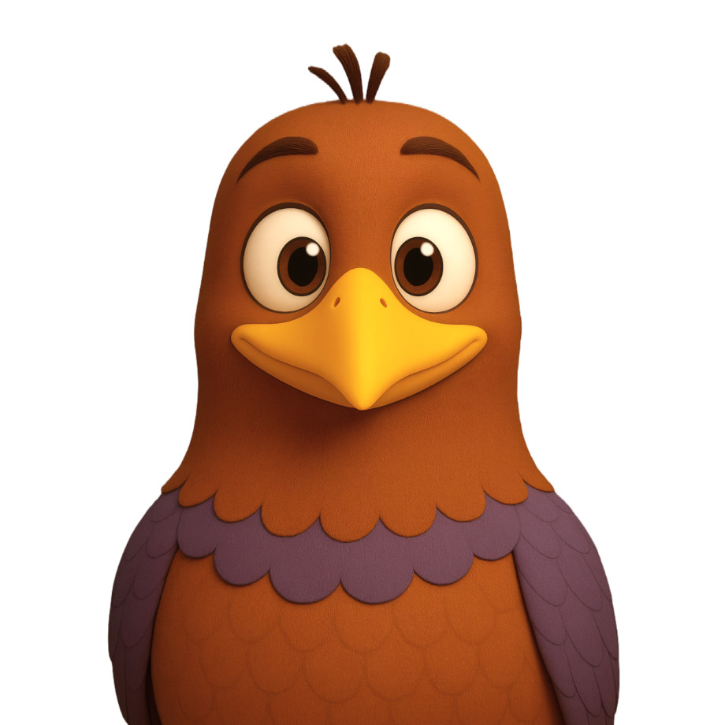
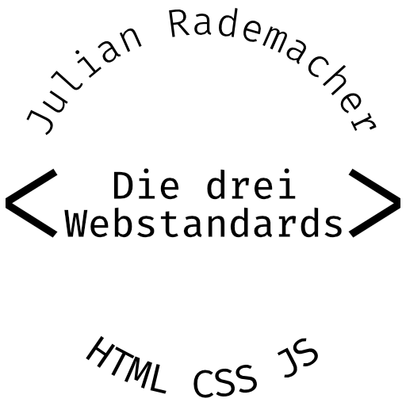

# Willkommen auf meinem GitHub Profil!

## Allgemein zu mir

Ich bin **Julian Rademacher** und seit etlichen Jahren im Internet unterwegs.  
Ich bin in Berlin aufgewachsen, wohne nun aber in [Hohen Neuendorf][HN],
 Brandenburg, im Speckgürtel und bin hier sehr glücklich.

[][blog]

[Seit fast 12 Jahren][ersterPost] betreibe ich [einen persönlichen Blog][blog],
 der in letzter Zeit leider etwas zu kurz gekommen ist.

[][D3W]

Seit einigen Jahren bin ich neben meinem Hauptberuf als Webentwickler &
 Systemadministrator bei der [fiveandfriends GmbH][fiveandfriends] auch als
 Einzelunternehmer im selben Bereich mit anderem Kundenschwerpunkt unter dem
 Namen [Julian Rademacher – Die drei Webstandards][D3W] tätig.

### Kontakt für Projektanfragen

Im Jahr 2022 werde ich keine Zeit mehr finden, neue Projekte umzusetzen. Ich
 werde von Mitte Mai bis Mitte November in Elternzeit sein.

Danach stehe ich aber gerne für Anfragen bereit:

[][c]

## Soziale Netzwerke

Als es im April 2022 dazu kam, dass Twitter von Elon Musk gekauft werden wollte,
 entschied ich mich, wie viele andere, in Zukunft meinen Mastodon-Account etwas
 aktiver zu bespielen. Aus diesem Grund werde ich hier auch nur meine beiden
 Mastodon-Handles verlinken:

- [@moortaube@mstdn.io]
- [@d3w@mas.to]

Auf anderen Plattformen bin ich zwar auch zu finden, halte mich da aber selten
 bis gar nicht auf.

[HN]: https://hohen-neuendorf.de/

[blog]: https://blog.moortaube.de/
[ersterPost]: https://blog.moortaube.de/2010/04/18/razorcms-1.-blogeintrag-moortaubes-blog/

[fiveandfriends]: https://fiveandfriends.com/

[D3W]: https://d3w.dev/
[c]: https://d3w.dev/c/

[@moortaube@mstdn.io]: https://mstdn.io/@moortaube
[@d3w@mas.to]: https://mas.to/@d3w
